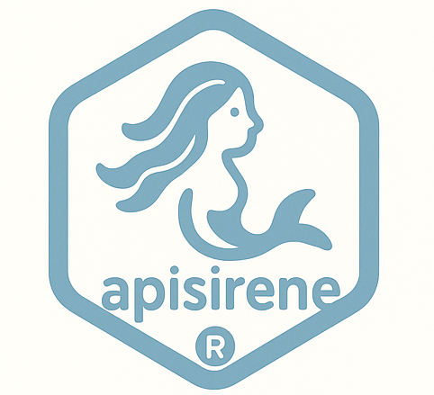
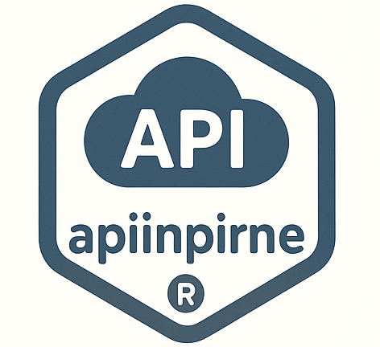
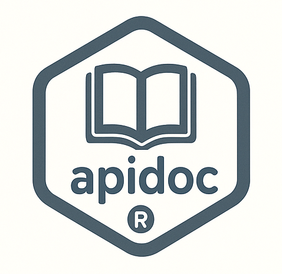

```{r, include = FALSE}
knitr::opts_chunk$set(
  collapse = TRUE,
	echo = FALSE,
	fig.align="center",
	fig.show="hold",
  comment = "#>"
)
```

```{r, out.width="15%"}
knitr::include_graphics(path = "../man/figures/logo_apimisc_center.png")
```

Le package `apimisc` simplifie l'utilisation de certaines API.

Il met en oeuvre et utilise 2 autres *packages* :

+ [`apisirene`](https://github.com/gilles13/apisirene){target="_blank"}
+ [`apiinpirne`](https://github.com/gilles13/apiinpirne){target="_blank"}

<center>
{width="15%"}
{width="15%"}
</center>

Pour bénéficier de toutes les fonctionnalités du *package*, l'utilisateur doit préalablement créer des comptes sur :

+ [Insee portail des api](https://www.portail-api.insee.fr){target="_blank"}

+ [Inpi connect](https://data.inpi.fr/register){target="_blank"}

+ [Webstat Banque de France](https://webstat.banque-france.fr/fr/){target="_blank"}

La description des formalités à réaliser est disponible dans l'aide ou
les vignettes des *packages*.

Il est toutefois possible d'utiliser certaines fonctions pour récupérer des données sans compte utilisateur.

C'est notamment le cas pour les API :

+ Eurostat

+ IMF (Fonds Monétaire International)

+ World Bank

+ OCDE ??

## Liens

Le *package* [`apidoc`](https://github.com/gilles13/apidoc){target="_blank"} fournit d'autres informations sur les API.

<center>
{width="25%"}
</center>

